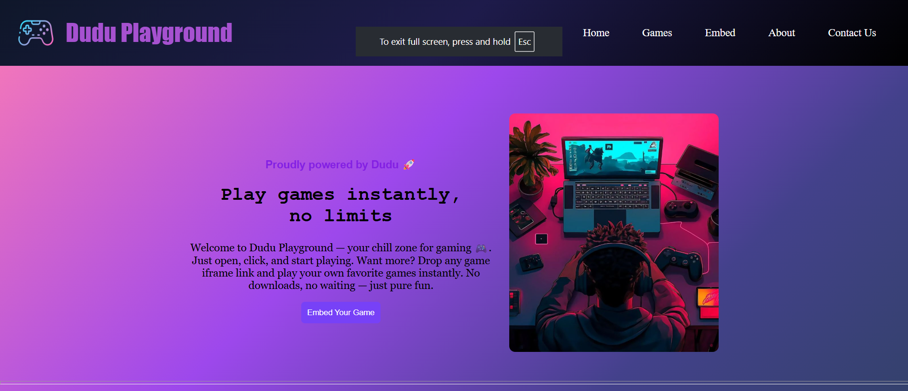
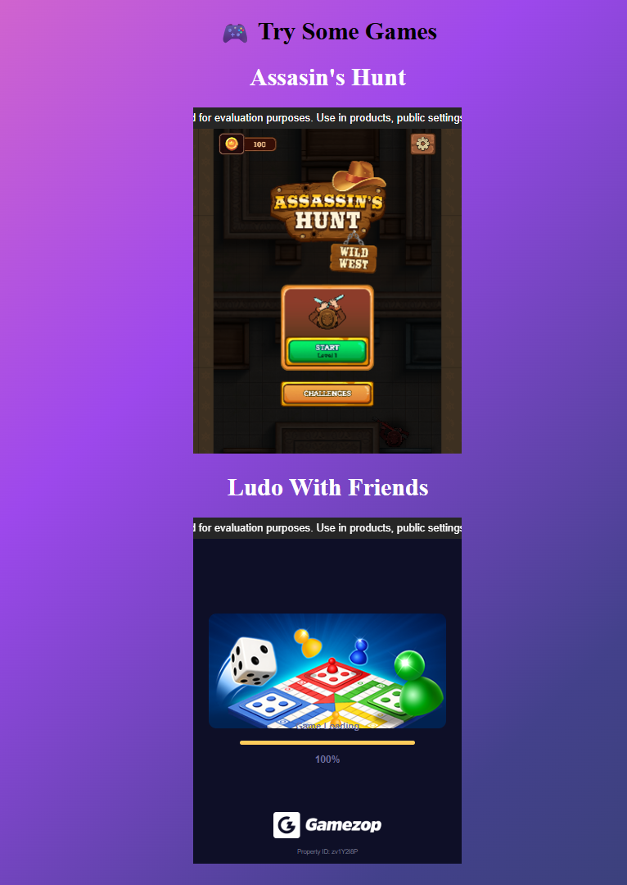
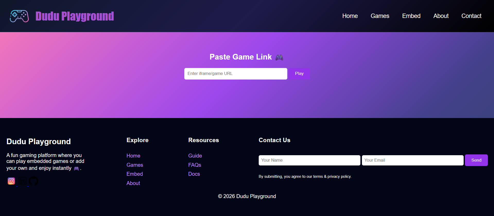
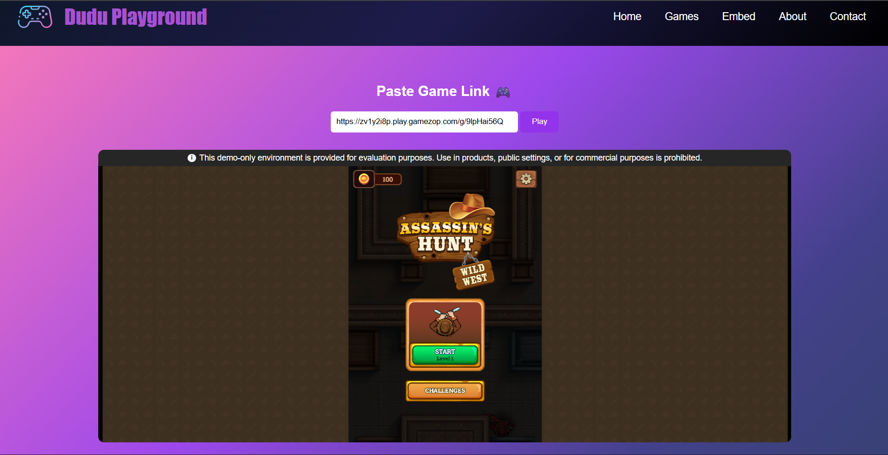
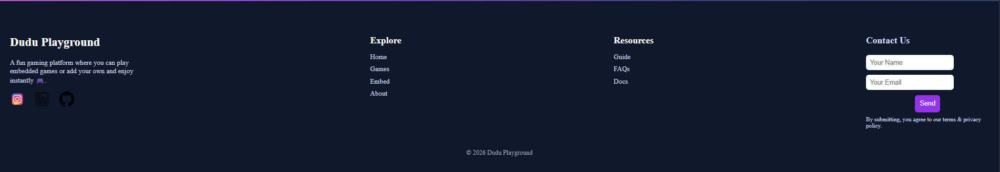

# 🎮 Dudu Playground

A fun and interactive gaming website where users can **play games instantly** or **embed their own games** using iframe links.

---

## 🚀 Features

* 🎮 Play online games instantly (no download required)
* 🔗 Embed your own games using iframe
* 🎬 Intro video with skip option
* 🧑‍💻 Clean and responsive UI
* 📩 Contact form with instant feedback
* 🌐 Social media integration

---

## 📸 Snapshots

### 🏠 Home Page



### 🎮 Games Section



### 🔗 Embed Page


<br>


### 📩 Contact Section



---

## 🛠️ Tech Stack

* HTML5
* CSS3
* JavaScript
* Google Fonts

---

## 📂 Project Structure

```
Dudu-Playground/
│── index.html
│── style.css
│── Embed.html
│── images/
│── screenshots/
```

---

## ⚙️ How It Works

* Loads intro video on start
* Displays main content after skip or video end
* Users can:

  * Play embedded games
  * Open custom embed page
  * Submit contact form

---

## 📌 Key Functionalities

* 🎥 **Intro Screen**
* 🎮 **Game Embedding via iframe**
* 🧠 **Dynamic Navigation**
* 📩 **Form Handling using JavaScript**

## 💡 Future Improvements

* Add user login system
* Add leaderboard
* Store user-added games
* Improve mobile responsiveness

---

## 👨‍💻 Author

* GitHub: https://github.com/mdudhe2007

---

## ⭐ Support

If you like this project, give it a ⭐ on GitHub!

---

<div align="center">© 2026 Dudu Playground</div>
